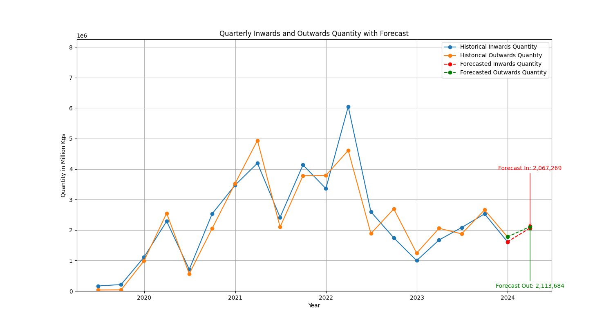


# BizForecast-EcoTrends

BizForecast-EcoTrends is an analytical framework developed by Rajat Maheshwari to provide economic trend forecasting through the analysis of inwards and outwards goods quantities. This tool employs Python 3 and utilizes the ARIMA (AutoRegressive Integrated Moving Average) statistical model to predict future trends, aiding businesses in making data-driven decisions.

## Features
- **Automated Data Cleaning**: Simplifies the preparation of data from diverse Excel files for analysis.
- **ARIMA Time Series Forecasting**: Harnesses the ARIMA model for robust forecasting of economic quantities.
- **Data Visualization**: Generates comprehensive graphs that display historical trends and predictive forecasts.

## Installation

### Prerequisites
Before running BizForecast-EcoTrends, ensure you have Python 3.x installed along with the following Python libraries:
- Pandas
- Matplotlib
- Statsmodels

You can install the required libraries using pip:
```bash
pip install pandas matplotlib statsmodels
```

### Setup
Clone the repository to your local machine:
```bash
git clone https://github.com/your-username/BizForecast-EcoTrends.git
cd BizForecast-EcoTrends
```

## Usage
The project is structured into two primary components:

### Data Cleaning
To clean your data, run:
```bash
python3 Data_Cleaning.py
```
*Note: The data cleaning script requires your own dataset due to privacy considerations.*

### Forecasting
Execute the forecasting script using:
```bash
python3 forecast.py
```
This will output the forecast graph for the next quarter.

## Example Output
Here is an example of a graph produced by the `forecast.py` script:



*Note: This graph is generated from sample data for demonstration purposes only.*

## Limitations
While BizForecast-EcoTrends leverages advanced ARIMA models to forecast economic trends, it's important to understand the model's inherent limitations. This forecasting tool is developed with a focus on historical time-series data, specifically inwards and outwards quantities, and does not incorporate external economic factors such as market demand, supply fluctuations, inflation rates, or geopolitical changes.

Additionally, the model does not account for sudden market disruptions or unanticipated events, which can significantly impact economic activities and their outcomes. As such, while BizForecast-EcoTrends provides a data-driven foundation for forecasting, the exclusion of these external variables could affect the precision and reliability of the forecasts.

Users should consider these limitations and apply complementary analysis to incorporate broader economic indicators and market conditions when making business decisions based on these forecasts. The tool is best used as one component in a comprehensive decision-making framework that considers a wide array of economic and market factors.


##
This README is a part of the BizForecast-EcoTrends Project by Rajat Maheshwari.


